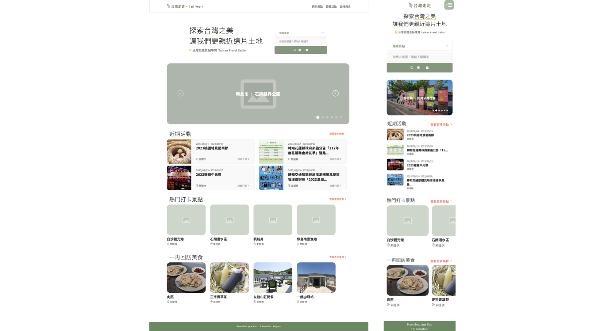
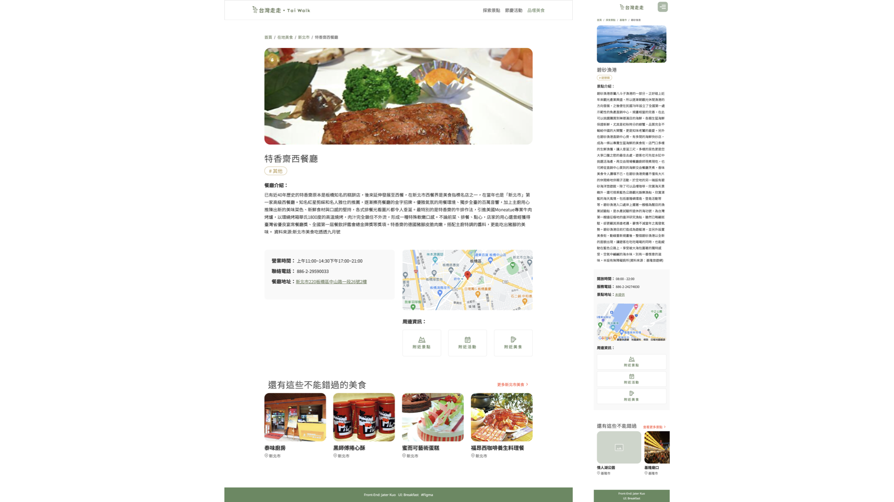
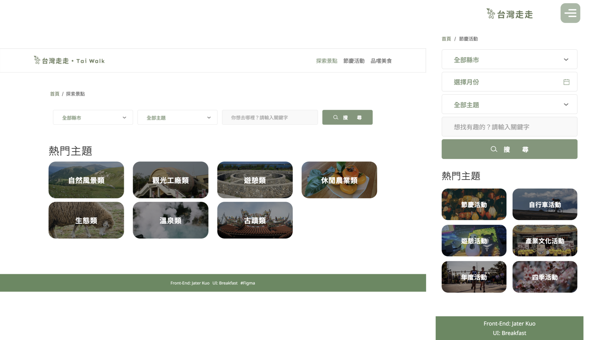
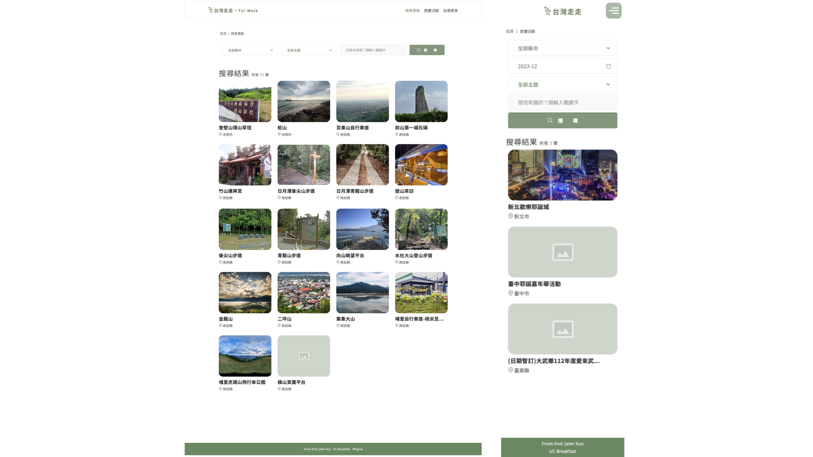
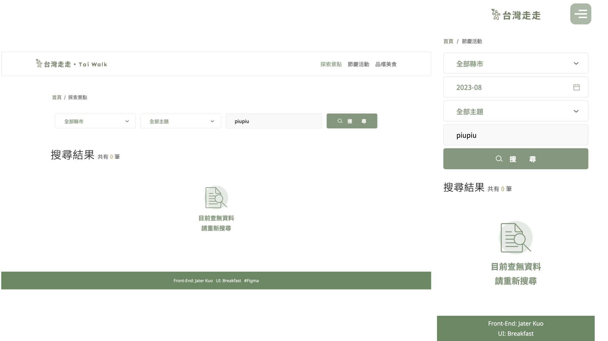

# taiwan-tourist-attractions-guide
+ 功能介紹：
  + 使用 Vue 2
  + 串接 TDX平臺之API
  + 使用者可以在首頁搜尋景點、活動、餐廳的關鍵字
  + 使用者可以在首頁看到5個隨機縣市之景點
  + 使用者可以在首頁看到4個近期活動
  + 使用者可以在首頁看到4個隨機景點
  + 使用者可以在首頁看到4個隨機餐廳
  + 使用者可以點擊景點、活動、餐廳的卡片進到內頁查看更多資訊
  + 使用者可以從內頁查看詳細資訊、Google Map位置
  + 使用者可以從內頁查看更多景點並點擊附近景點、附近活動、附近美食查詢更多資訊
  + 使用者可以從搜尋頁面根據縣市、主題、月份、分類以及關鍵字查詢更多的景點、活動或是餐廳

  
+ GitHub Page :
https://kuochiuhsiang.github.io/taiwan-tourist-attractions-guide/

## ScreenShots (desktop ver. and mobile ver.)
  * Preview Image 
  
  * Home Page 
  
  * Scenic-Spot/Activity/Restaurant Page
  
  * Search Page
  
  * Result Page
  
  * no-Result Page
  


## Project setup
```
npm install
```

### Compiles and hot-reloads for development
```
npm run serve
```

### Compiles and minifies for production
```
npm run build
```

### Lints and fixes files
```
npm run lint
```

### Customize configuration
See [Configuration Reference](https://cli.vuejs.org/config/).
